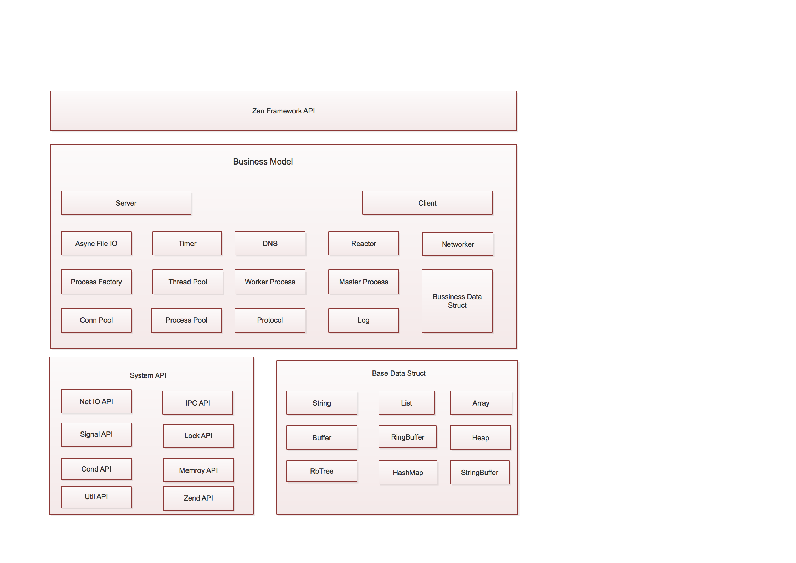

zan 框架架构图
=========================

Zan 框架内部由多个子模块组成，主要可以分为如下几部分：
    1. TcpServer/TcpClient/HttpServer/HttpClient/Redis/MySql/AsyncIO/Timer 等用户接口；

    2. 基础数据结构，包括List、String、HashMap、Buffer、Array 等；
    
    3. 操作系统接口封装，Socket、IPC、Signal、Lock 等；
    
    4. 内部子模块，异步IO、Timer、DNS、Reactor、Factory 等；

