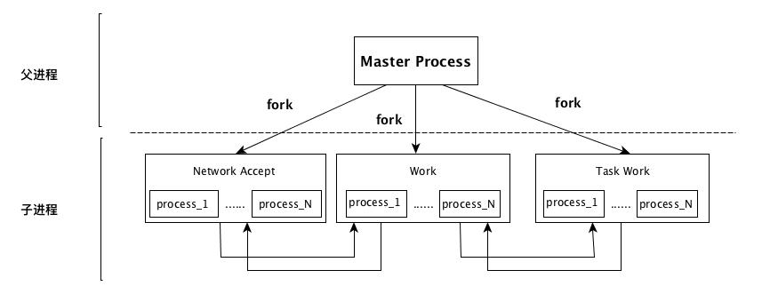
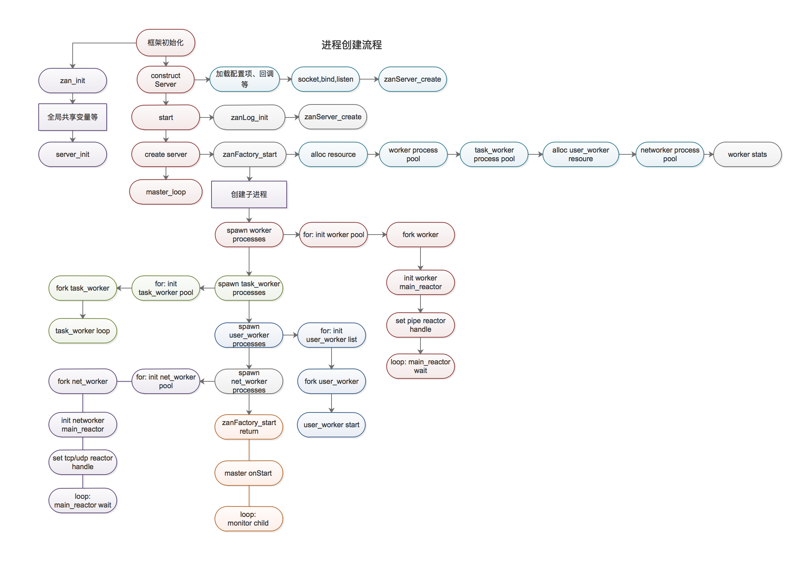

zan 框架进程模型
=========================

Zan 框架进程模型简介：

1. Zan 框架目前只有多进程模型：
    我们以 TcpServer 来介绍框架的进程模型，HttpServer 继承自 TcpServer, 创建流程相同；

2. 进程组成：
:: 

    默认情况下，Zan 框架只会创建 Master 进程、Networker 进程以及 Worker 进程；
    Networker 和 Worker 进程的数量和机器的 CPU 核心数据相同；

3. 进程数量配置：
::

  当用户配置了 task_worker_num 参数，框架会创建指定数量的 TaskWorker 进程；
  当用户配置了 net_worker_num、worker_num 参数后，框架会创建指定数量的 networker 和 worker 进程；
  如果在 server 启动前调用 $server->addProcess()，则框架会创建指定的 UserWorker 进程；

4. Master 进程：
::

    在 Master 进程启动过程中，初始化全局变量，框架会创建 Server 对象，根据用户的配置 fork 子进程；
    当所有进程创建完成后，Master 调用 onStart 回调，并进入循环，开始监控子进程的异常退出，当发现子进程异常退出后，
    重新 fork 该子进程；
    注：不要在 onStart 回调中执行除了修改进程名、打印启动日志等其它代码，Master 进程只承担监控子进程的功能；

5. NetWorker 进程：
::

    在 Master 进程中，TcpServer 会创建 socket，并 bind 指定的 Ip 和 Port；
    在 Networker 进程中，调用 accept 接收 client 的连接，Networker 通过抢锁决定是否调用 Accept 接口；
    NetWorker 功能主要有：接收新的 Client 的连接，接收 Client 发送的消息并将消息分发给 Worker 进程，
              接收 Worker 进程发送的数据并发送给 Client；
    所有 Client 的连接都保存在各个 Networker 进程中，如果某个 Networker 进程异常退出，
    则此 Networker 进程持有的 Client 连接都失效，Client 需要重新连接才能收发数据；

6. Worker 进程：
::

    Worker 进程是真正干活的进程，onWorkerStart、onConnect、onReceive、onWorkerStop、onClose、onFinish 回调中的
    代码都运行在 Worker 进程中；
    如果设置了 max_request 参数，则当某个 worker 进程在收到 max_request 个请求后，该 worker 进程就会退出，Master 进程会重新创建一个新的 Worker 进程；

7. TaskWorker 进程:
::

    如果用户配置了 task_worker_num 参数，则框架会创建指定数目的 TaskWorker 进程，一般情况下，
    task_worker 进程用来执行运行比较慢的任务；onTask 回调中的所有代码都跑在 TaskWorker 进程中；

===========
进程模型图
===========

==============
框架启动流程
==============

下图展示了使用 Zan 框架创建一个 TcpServer 时的整个启动流程

主要步骤如下：

1. 框架初始化：
::

   PHP引擎初始化，调用PHP_MINIT_FUNCTION(zan)，调用 zan 框架各个模块的初始化函数等；

2. 构造函数：
::

   设置 Server 运行时参数，设置事件回调函数，创建 socket 并监听端口

3. $serv->start：
::

   启动 Server，初始化日志，并调用 zanServer_create 分配全局共享变量，用于存储客户端连接，创建 Factory；

4. Factory start，为各个进程分配资源：
::

   调用 zanFactory_start 执行真正的启动流程，先为各个进程全局资源，主要包括管道、消息队列、共享内存、锁；

5. 创建子进程：
::

   依次 fork 各个子进程，worker 进程、Taskworker 进程、UserWorker 进程、NetWorker 进程；

6. 子进程循环：
::

   在各个子进程创建成功后，为各个子进程分配固定的 worker_id、管道，设置进程类型，获取 Pid，并将这些值存储在全局变量中；
   之后各个子进程进入自己的循环中，初始化 Reactor，调用 onWorkerStart 并进入循环；

7. Master 进程循环：
::

   之后 Master 进程调用 onStart 回调，并进入 zan_master_process_loop，监控各个子进程的退出；

