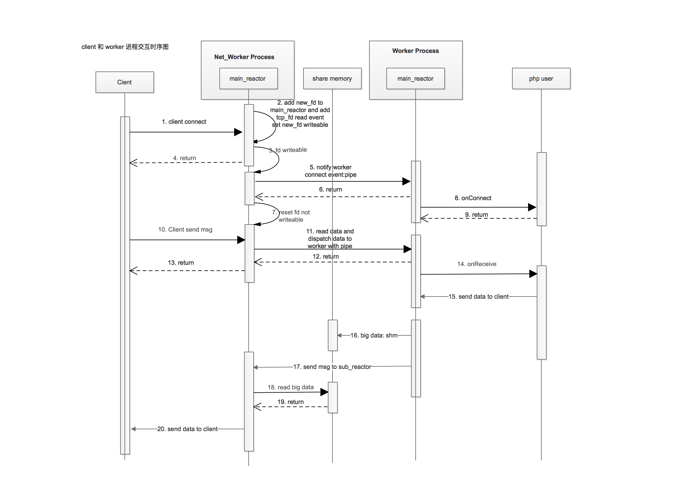

Server 接收消息流程
=========================

简介:
    以 TcpServer/Client 为例，当一个 Client 连接成功并发送消息给 Server 的整个流程。
 

如上图所示，我们简单描述一下 TcpServer 接收 Client 消息的过程

1. Client 端向服务端发起连接请求，所有的 Networker 进程都会被唤醒，通过 epoll 触发 zanReactor_onAccept 函数的调用，
   开始进行抢锁，抢锁失败的进程直接返回，抢锁成功的进程继续执行 accept 接收 Client 的连接，new_fd 是 accept 的返回值；

2. Networker 进程将 Client 的 new_fd 加入到 NetWorker 进程的 main_reactor 监听列表，并设置 new_fd 句柄为可写；

3. Networker 进程设置 new_fd 可写后，向 Client 返回(4)；

5. new_fd 句柄可写，于是 Epoll 触发并执行 zanNetworker_onWrite 函数，Networker 进程向 Worker 进程发送消息，
   调用 factory.notify 函数将消息写入 Worker 进程的管道中，通知 Worker 进程有新的 Client 连接，并返回(6)；

7. Networker 进程将 new_fd 的可写事件取消；

8. Worker 的管道收到数据，Epoll 触发并调用 zanWorker_onPipeRead 函数读取数据，发现消息为 SW_EVENT_CONNECT 事件消息
   回调 serv->onConnect 函数，并执行用户在 onConnect 回调中编写的 Php 代码；

10. Client 调用 send 接口向 Server 发送消息，Networker 进程收到消息并调用 zanNetworker_onRead 函数;

11. Networker 进程最后会调用到 Port 中的 swPort_onRead_raw 函数，并调用 factory.dispatch 将消息分发给 Worker 进程，
    Networker 进程先选择 Worker 进程，然后调用 zanNetworker_send2worker 将消息发送给 Worker 进程，同样是通过写管道的方式；
    在这里会有点不同，具体请看 zanNetworker_send2worker 函数的具体实现；

14. 同(8)，Worker 进程收到消息后，最后会调用 serv->onReceive 回调，执行用户的 Php 代码；

15. 如果用户在 onReceive 的回调中，调用 send 向 Client 发送消息；首先会调用到 PHP_METHOD(swoole_server, send) 函数中，
    然后调用 zanServer_tcp_send 发送消息，这分两种情况，如果要发送的数据大于 8M，则走第 (16) 步将数据写入 Worker 进程关联的
    共享内存中；如果要发送的数据小于 8M，则略过第 (16) 步；

16. 如第(15)步所说，如果消息大于 8M，则 Worker 进程将数据写入共享内存中，并标明该数据为大数据块，zanFactory_finish 中实现；

17. Worker 进程调用 zanFactory_finish，zanWorker_send2networker 将数据发送给 Networker 进程；

18. Networker 进程收到 Worker 进程发送的数据，Epoll 触发并调用 zanNetworker_onPipeReceive，如果是大块数据，则从共享内存中读取；
    如果是小块数据，则直接从消息体中读取；

20. NetWorker 进程调用 zanNetworker_send 将消息发送给 Client 端；
