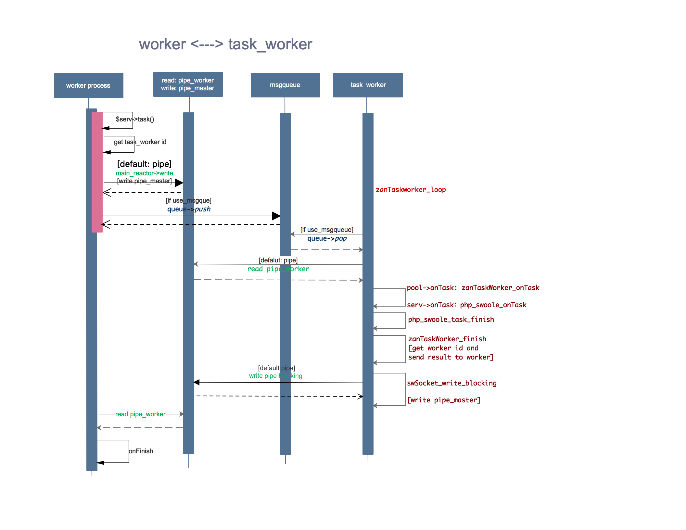

Worker 进程和 Taskworker
============================================

下图是 worker 进程和 Taskworker 之间的消息交互:
    

如上图所示，我们简单描述一下 worker 进程和 taskworker 进程之间的消息交互

1. taskworker 在启动后，进程 zanTaskworker_loop 死循环中，阻塞在管道或消息队列的读操作上，等待 worker 进程的消息；

2. 在 PHP 代码中，调用 $serv->task() 接口(运行在 worker 进程中)，即调用 PHP_METHOD(swoole_server, task) 函数；
   然后调用 zanPool_dispatch_to_taskworker 函数将消息分发到 taskworker 进程中；如果设置了 task_ipc_mode 值为 2/3，
   则 worker 进程向 taskworker 进程发送消息使用消息队列，否则默认使用管道；(消息队列并没有什么优势，见意默认)

3. 在 taskworker 进程 zanTaskworker_loop 函数中，当读管道或消息队列接口返回时，表示收到 worker 进程发送的数据；
   读取数据，并调用 pool->onTask(即zanTaskworker_onTask) 接口，然后调用 serv->onTask 处理 PHP 代码；

4. 对于调用 finish 有两种情况，第一种，onTask 回调中主动调用 $serv->finish()，即 PHP_METHOD(swoole_server, finish)，
   然后调用 php_swoole_task_finish->zanTaskworker_finish->zanWorker_send2worker 向 worker 返回结果；

5. 第二种，onTask 没有调用 $serv->finish，但是使用 return 返回了非 0 值；
   则调用流程为 php_swoole_onTask(serv->onTask)->php_swoole_task_finish->zanTaskworker_finish，向 worker 返回结果；

6. Worker 进程收到消息后，最后会调用到 zanWorker_onPipeRead->zanWorker_onTask 中，然后 Worker 进程发现消息类型为 
   SW_EVENT_FINISH，调用 $serv->onFinish() 接口，执行 PHP 回调的 onFinish 代码；
